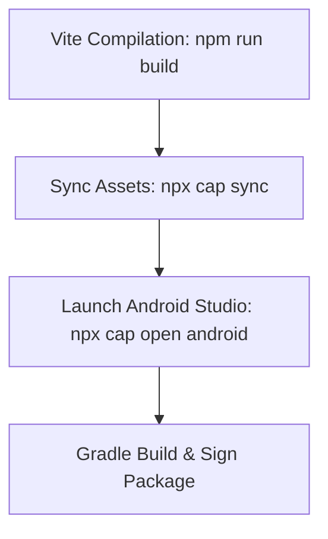

# BharatConnect: Android Packaging & Build Specification

This document details the configuration, build commands, signing steps, and release checks required to package **BharatConnect** as a production-ready Android App (`.apk` or `.aab`) using Capacitor.

---

## 1. Native Permissions Configurations

All required permissions must be declared in both the [AndroidManifest.xml](file:///c:/Users/Vipin/OneDrive/Desktop/WebAplications/BharatConnect/apps/frontend/AndroidManifest.xml) and requested dynamically inside the React client.

### Android Permission Mapping

| Module Feature | Android Manifest Permission | Justification |
| :--- | :--- | :--- |
| **Contacts Discovery** | `android.permission.READ_CONTACTS` | To hash and match phone numbers in local contacts list. |
| **Camera (Chat Media)** | `android.permission.CAMERA` | To capture photos/videos for E2EE chat messages. |
| **Voice Notes** | `android.permission.RECORD_AUDIO` | To record voice notes for chat threads. |
| **GPS Location (Nearby & SOS)** | `android.permission.ACCESS_FINE_LOCATION`, `android.permission.ACCESS_BACKGROUND_LOCATION` | Required for range queries and background location presences. |
| **FCM Push Notifications** | `android.permission.POST_NOTIFICATIONS` | Required on Android 13+ (API 33+) to send push notifications. |

---

## 2. Capacitor Project Setup

Ensure Capacitor dependencies are installed inside the `@bharatconnect/frontend` package:

```bash
# Add Android platform target
npx cap add android
```

Your [capacitor.config.ts](file:///c:/Users/Vipin/OneDrive/Desktop/WebAplications/BharatConnect/apps/frontend/capacitor.config.ts) is configured to look at the `dist` build output directory of Vite.

---

## 3. Step-by-Step Build Instructions

Follow this sequence to compile and build the Android application package:



### 1. Compile the React PWA SPA
Compile and minify Vite static assets:
```bash
npm run build -w apps/frontend
```

### 2. Synchronize Assets to Android Project
Copy compiled Web files and plugin configurations into the native Android folder:
```bash
npx cap sync
```

### 3. Open Project in Android Studio
Launch Android Studio bound to the project folder:
```bash
npx cap open android
```

---

## 4. Release Build & Cryptographic Signing

For Google Play Store distribution, compile the app as an **Android App Bundle (AAB)** and sign it with a secure Keystore.

### Step 1: Generate Release Keystore
Run the JDK keytool to generate a keystore file (`release-key.keystore`):
```bash
keytool -genkey -v -keystore release-key.keystore -alias bharatconnect-alias -keyalg RSA -keysize 2048 -validity 10000
```
> [!IMPORTANT]
> Keep the keystore file secure and backup the passwords. If lost, you will be unable to upload updates to the Play Store.

### Step 2: Configure Gradle Signing
Inside Android Studio, update `android/app/build.gradle` to reference the keystore:

```groovy
android {
    ...
    signingConfigs {
        release {
            storeFile file("../../release-key.keystore")
            storePassword "YOUR_KEYSTORE_PASSWORD"
            keyAlias "bharatconnect-alias"
            keyPassword "YOUR_KEY_PASSWORD"
        }
    }
    buildTypes {
        release {
            signingConfig signingConfigs.release
            minifyEnabled true
            shrinkResources true
            proguardFiles getDefaultProguardFile('proguard-android-optimize.txt'), 'proguard-rules.pro'
        }
    }
}
```

---

## 5. Google Play Store Submission Checklist

*   `[ ]` **Android 13 Post-Notification Prompt:** Ensure your React app checks and prompts the user for `POST_NOTIFICATIONS` permissions before subscribing to FCM token updates.
*   `[ ]` **Background Geolocation Declaration:** Because BharatConnect requests `ACCESS_BACKGROUND_LOCATION` to update nearby presence, Google requires a detailed video demonstration and privacy disclosure explaining why background tracking is essential.
*   `[ ]` **Data Safety Declaration:** Declare that messaging texts are **encrypted client-side (E2EE)** and unreadable by the company, and that contact hashes are transmitted over SSL and never saved permanently.
*   `[ ]` **Target SDK Compliance:** Ensure the `compileSdkVersion` and `targetSdkVersion` in `android/variables.gradle` are pointing to Android 13+ (API level 33 or 34) to comply with current Google Play requirements.
