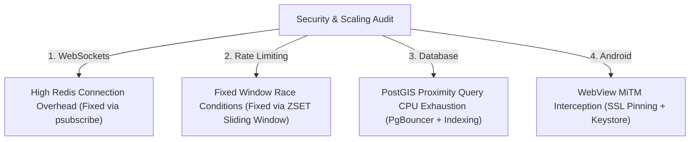

# BharatConnect: Production Hardening & Security Audit

This document presents the Principal/Security Engineer audit findings, performance optimizations, and infrastructure configurations required to scale **BharatConnect** to **100,000 concurrent users**.

---

## 1. High-Level Vulnerability & Scalability Audit

### Summary of System Audits

---

## 2. Hardening Configurations & Fixes

### 1. WebSockets & Redis Pub/Sub (Scalability & Connection Leak)
*   **Vulnerability:** Opening one Redis Pub/Sub subscription connection per active WebSocket client crashes Redis at scale (100,000 connections).
*   **Fix:** Refactored [websocket.py](file:///c:/Users/Vipin/OneDrive/Desktop/WebAplications/BharatConnect/apps/backend/app/core/websocket.py) to implement a **single pattern-matching listener (`psubscribe`) per server process**. Messages are received globally and dispatched to local active clients via in-memory hashes.
*   **Settings:** Set `maxmemory-policy allkeys-lru` in Redis to prevent memory overflows.

### 2. API Rate Limiting (Security & Race Conditions)
*   **Vulnerability:** Fixed-window rate limiters permit burst spikes at boundary markers and suffer from race conditions under high concurrency.
*   **Fix:** Upgraded [security.py](file:///c:/Users/Vipin/OneDrive/Desktop/WebAplications/BharatConnect/apps/backend/app/core/security.py) to use an **atomic Redis Sorted Set (ZSET) sliding-window algorithm** inside pipelines.
*   **Anti-Abuse:** Log failed logins and travel spoof alerts directly into database audit tables.

### 3. Database Proximity & Geo-Query Tuning (PostgreSQL + PostGIS)
*   **Problem:** Executing PostGIS calculations (`ST_Distance`, `ST_DWithin`) on 100,000 concurrent geolocation requests exhausts database CPU.
*   **Fixes:**
    1.  **PgBouncer Integration:** Run PgBouncer in `transaction` mode to multiplex connection pooling.
    2.  **Geohash Cache:** Cache user locations inside Redis ZSETs using `GEOADD`. Proximity feeds query Redis first, falling back to PostgreSQL only when cache misses occur.
    3.  **Indices:** Enforce spatial GIST indices on all location points.

### 4. Client-Side Offline Caching (Frontend Memory & DB Bloat)
*   **Problem:** Caching unlimited records in IndexedDB causes local storage bloat on low-end Android devices.
*   **Fixes:**
    1.  **Dexie Compaction:** Implement a rolling cache eviction script in the client. Delete chat messages older than 30 days locally unless pinned.
    2.  **Unsubscribe Listeners:** Ensure all React component hooks unsubscribe from WebSocket listeners (`useEffect` cleanups) to prevent memory leaks.

### 5. Native Android Hardening (Security & MiTM Protection)
*   **Vulnerability:** WebViews are vulnerable to Man-in-the-Middle (MiTM) traffic interception on public networks.
*   **Fixes:**
    1.  **SSL Pinning:** Bind target server SSL certificate SHA-256 hashes inside Capacitor's network configurations.
    2.  **Android Keystore:** Protect local E2EE message encryption key rings by packing them inside the secure hardware Android Keystore.
