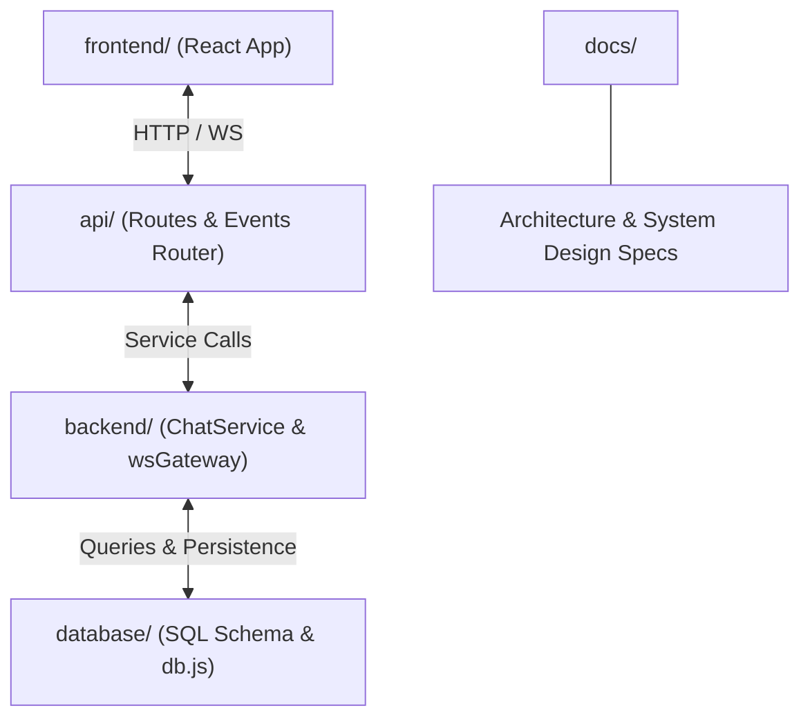

# BharatConnect 🇮🇳 — Modern Production Text Messaging Platform

BharatConnect is an ultra-fast, secure, reliable, and scalable text messaging platform built from first principles for high-throughput, low-latency text communication across mobile and desktop devices.

---

## 🏗️ Architecture & Folder Separation

The platform follows a decoupled, modular architecture where responsibilities are separated across dedicated folders, with **`api/`** serving as the central connection hub:

```
BharatConnect/
├── index.js          # Root Master Initiator (Boots DB, Backend, and API Gateway)
├── package.json      # Root NPM script launcher
├── api/              # Central Connection Bridge: REST Routes & WebSocket Event Dispatchers
├── backend/          # Core Business Services (ChatService) & WebSocket Gateway Engine
├── database/         # Database Layer: DDL Schemas (SQL) & Abstract Data Engine (db.js)
├── docs/             # Product Requirements, System Architecture, and Schemas
└── frontend/         # React (Vite) Web Application with Glassmorphism UI
```

---

## 🔌 Inter-Folder Connection Architecture



- **`frontend/`**: Contains all UI components and client WebSocket handlers.
- **`api/`**: Acts as the central bridge/connector linking HTTP/WS network requests to backend business services and database queries.
- **`backend/`**: Contains core business logic (`chatService.js`) and real-time socket gateway (`wsGateway.js`).
- **`database/`**: Contains database schemas (`schema.sql`) and data storage model engine (`db.js`).
- **`docs/`**: Contains architecture blueprints and product requirement specifications.

---

## 🚀 Quick Start Guide (Single Command Initiation)

### Initiating Everything from Root
To initiate the entire system with a single command from the project root:

```bash
npm start
# or
node index.js
```

This single command initializes:
1. Database Engine & pre-configured accounts.
2. Backend Business Logic & WebSocket Gateway Engine.
3. Unified API Gateway listening on `http://localhost:5000` (`/api/v1` REST + `ws://localhost:5000`).

### Running the Frontend App
In a separate terminal window:
```bash
cd frontend
npm run dev
```
Open `http://localhost:5173` to test live multi-user messaging!

---

## 📚 Documentation Index

- 📘 [docs/product_requirements.md](docs/product_requirements.md)
- 🏗️ [docs/system_architecture.md](docs/system_architecture.md)
- 🗄️ [docs/database_schema.md](docs/database_schema.md)
- 📖 [docs/bharatsphere_comprehensive_guide.md](docs/bharatsphere_comprehensive_guide.md)
