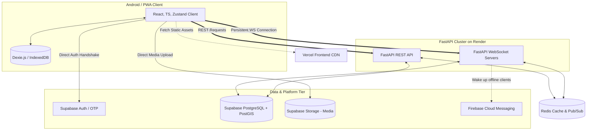
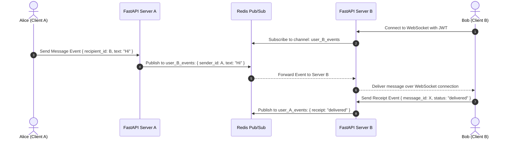
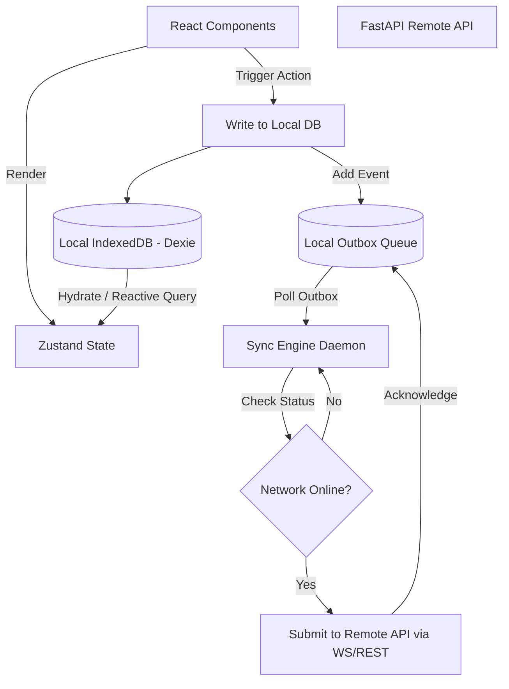

# BharatConnect: Production-Ready System Architecture

This document outlines the end-to-end system architecture, database schema, API structure, real-time communication design, folder structure, security protocols, and offline capabilities for **BharatConnect**—an Android-first, WhatsApp-like application.

---

## 1. High-Level System Architecture

BharatConnect utilizes a hybrid cloud architecture combining serverless components for database, authentication, and file storage (Supabase, Firebase) with dedicated containerized servers (FastAPI on Render) for WebSockets, custom business logic, and real-time coordination. Redis acts as the caching and pub/sub backbone to scale real-time operations.



### Infrastructure Mapping

| Component | Technology | Hosting Provider | Justification |
| :--- | :--- | :--- | :--- |
| **Frontend SPA** | React + TypeScript + Vite | **Vercel** | Global Edge CDN, instant previews, optimized for Progressive Web Apps (PWAs). |
| **Backend Services** | FastAPI + Uvicorn | **Render** | Native support for WebSockets, async Python execution, automatic horizontal scaling, simple Docker deployments. |
| **Database** | PostgreSQL + PostGIS | **Supabase** | Managed SQL database, native geospatial extensions (PostGIS), built-in Row-Level Security (RLS). |
| **Authentication** | Supabase Auth | **Supabase** | Out-of-the-box support for SMS OTP (essential for WhatsApp clones), OAuth, and secure JWT generation. |
| **Media Storage** | Supabase Storage | **Supabase** | S3-compatible object storage with built-in CDN caching, access-control policies matching database RLS. |
| **In-Memory Cache & Pub/Sub** | Redis | **Upstash / Redis (Render)** | Low-latency state management, WebSocket scaling via Redis Pub/Sub, API rate limiting. |
| **Push Notifications** | Firebase Cloud Messaging (FCM) | **Firebase** | Native Android background wakeup, silent payload delivery for offline message synchronization. |

---

## 2. Database Schema (PostgreSQL + PostGIS)

To support the localized features (Nearby Right Now, Verified Help, Need It Now) alongside classic messaging, the schema utilizes PostGIS for geospatial coordinates.

```mermaid
erDiagram
    PROFILES ||--o{ CHAT_MEMBERS : participates
    PROFILES ||--o{ MESSAGES : sends
    PROFILES ||--o{ MESSAGE_RECEIPTS : receives
    PROFILES ||--o{ HELP_REQUESTS : requests
    PROFILES ||--o{ HELP_RESPONSES : volunteers
    PROFILES ||--o{ NEED_IT_NOW_REQUESTS : demands
    PROFILES ||--o{ NEED_IT_NOW_BIDS : bids

    CHATS ||--o{ CHAT_MEMBERS : contains
    CHATS ||--o{ MESSAGES : contains
    MESSAGES ||--o{ MESSAGE_RECEIPTS : tracks

    HELP_REQUESTS ||--o{ HELP_RESPONSES : has
    NEED_IT_NOW_REQUESTS ||--o{ NEED_IT_NOW_BIDS : has

    PROFILES {
        uuid id PK
        string phone UNIQUE
        string display_name
        string avatar_url
        geography location_coordinates
        timestamp location_updated_at
        boolean is_verified_helper
        float helper_trust_score
        timestamp created_at
    }

    CHATS {
        uuid id PK
        string type "direct | group"
        string title "null for direct"
        string avatar_url
        timestamp created_at
        timestamp updated_at
    }

    CHAT_MEMBERS {
        uuid chat_id FK
        uuid profile_id FK
        string role "admin | member"
        timestamp joined_at
        uuid last_read_message_id
    }

    MESSAGES {
        uuid id PK
        uuid chat_id FK
        uuid sender_id FK
        string content_type "text | image | video | audio | location"
        text text_content
        string attachment_url
        geography location_content
        timestamp created_at
    }

    MESSAGE_RECEIPTS {
        uuid message_id FK
        uuid profile_id FK
        string status "sent | delivered | read"
        timestamp updated_at
    }

    HELP_REQUESTS {
        uuid id PK
        uuid requester_id FK
        string title
        text description
        string category
        geography location
        string status "open | assigned | resolved"
        float min_trust_score
        timestamp created_at
    }

    HELP_RESPONSES {
        uuid id PK
        uuid request_id FK
        uuid volunteer_id FK
        string status "proposed | accepted | rejected"
        timestamp created_at
    }

    NEED_IT_NOW_REQUESTS {
        uuid id PK
        uuid requester_id FK
        string title
        text description
        decimal budget_estimate
        geography location
        string status "active | fulfilled | expired"
        timestamp created_at
    }

    NEED_IT_NOW_BIDS {
        uuid id PK
        uuid request_id FK
        uuid bidder_id FK
        decimal bid_amount
        text message
        string status "pending | accepted | rejected"
        timestamp created_at
    }
```

### PostgreSQL DDL Definitions & Geospatial Indices

```sql
-- Enable PostGIS extension for geospatial features
CREATE EXTENSION IF NOT EXISTS postgis;

-- Enable UUID extension
CREATE EXTENSION IF NOT EXISTS "uuid-ossp";

-- 1. Profiles Table
CREATE TABLE public.profiles (
    id UUID REFERENCES auth.users ON DELETE CASCADE PRIMARY KEY,
    phone VARCHAR(20) UNIQUE NOT NULL,
    display_name VARCHAR(100),
    avatar_url TEXT,
    location_coordinates GEOGRAPHY(Point, 4326),
    location_updated_at TIMESTAMPTZ,
    is_verified_helper BOOLEAN DEFAULT FALSE,
    helper_trust_score NUMERIC(3, 2) DEFAULT 5.00 CHECK (helper_trust_score BETWEEN 0.00 AND 5.00),
    created_at TIMESTAMPTZ DEFAULT NOW() NOT NULL
);

-- 2. Chats Table
CREATE TABLE public.chats (
    id UUID DEFAULT uuid_generate_v4() PRIMARY KEY,
    type VARCHAR(10) CHECK (type IN ('direct', 'group')) NOT NULL,
    title VARCHAR(100), -- Null for direct chats
    avatar_url TEXT,
    created_at TIMESTAMPTZ DEFAULT NOW() NOT NULL,
    updated_at TIMESTAMPTZ DEFAULT NOW() NOT NULL
);

-- 3. Chat Members Table (Composite PK)
CREATE TABLE public.chat_members (
    chat_id UUID REFERENCES public.chats(id) ON DELETE CASCADE,
    profile_id UUID REFERENCES public.profiles(id) ON DELETE CASCADE,
    role VARCHAR(10) CHECK (role IN ('admin', 'member')) DEFAULT 'member',
    joined_at TIMESTAMPTZ DEFAULT NOW() NOT NULL,
    last_read_message_id UUID,
    PRIMARY KEY (chat_id, profile_id)
);

-- 4. Messages Table
CREATE TABLE public.messages (
    id UUID DEFAULT uuid_generate_v4() PRIMARY KEY,
    chat_id UUID REFERENCES public.chats(id) ON DELETE CASCADE NOT NULL,
    sender_id UUID REFERENCES public.profiles(id) ON DELETE SET NULL,
    content_type VARCHAR(15) CHECK (content_type IN ('text', 'image', 'video', 'audio', 'location')) NOT NULL,
    text_content TEXT,
    attachment_url TEXT,
    location_content GEOGRAPHY(Point, 4326),
    created_at TIMESTAMPTZ DEFAULT NOW() NOT NULL
);

-- 5. Message Receipts Table
CREATE TABLE public.message_receipts (
    message_id UUID REFERENCES public.messages(id) ON DELETE CASCADE,
    profile_id UUID REFERENCES public.profiles(id) ON DELETE CASCADE,
    status VARCHAR(10) CHECK (status IN ('sent', 'delivered', 'read')) NOT NULL,
    updated_at TIMESTAMPTZ DEFAULT NOW() NOT NULL,
    PRIMARY KEY (message_id, profile_id)
);

-- 6. Verified Help Requests
CREATE TABLE public.help_requests (
    id UUID DEFAULT uuid_generate_v4() PRIMARY KEY,
    requester_id UUID REFERENCES public.profiles(id) ON DELETE CASCADE NOT NULL,
    title VARCHAR(150) NOT NULL,
    description TEXT NOT NULL,
    category VARCHAR(50) NOT NULL,
    location GEOGRAPHY(Point, 4326) NOT NULL,
    status VARCHAR(15) CHECK (status IN ('open', 'assigned', 'resolved')) DEFAULT 'open',
    min_trust_score NUMERIC(3, 2) DEFAULT 3.00,
    created_at TIMESTAMPTZ DEFAULT NOW() NOT NULL
);

-- 7. Need It Now Requests
CREATE TABLE public.need_it_now_requests (
    id UUID DEFAULT uuid_generate_v4() PRIMARY KEY,
    requester_id UUID REFERENCES public.profiles(id) ON DELETE CASCADE NOT NULL,
    title VARCHAR(150) NOT NULL,
    description TEXT NOT NULL,
    budget_estimate NUMERIC(10, 2),
    location GEOGRAPHY(Point, 4326) NOT NULL,
    status VARCHAR(15) CHECK (status IN ('active', 'fulfilled', 'expired')) DEFAULT 'active',
    created_at TIMESTAMPTZ DEFAULT NOW() NOT NULL
);

-- 8. Need It Now Bids
CREATE TABLE public.need_it_now_bids (
    id UUID DEFAULT uuid_generate_v4() PRIMARY KEY,
    request_id UUID REFERENCES public.need_it_now_requests(id) ON DELETE CASCADE NOT NULL,
    bidder_id UUID REFERENCES public.profiles(id) ON DELETE CASCADE NOT NULL,
    bid_amount NUMERIC(10, 2) NOT NULL,
    message TEXT,
    status VARCHAR(15) CHECK (status IN ('pending', 'accepted', 'rejected')) DEFAULT 'pending',
    created_at TIMESTAMPTZ DEFAULT NOW() NOT NULL
);

-- --- Geospatial & Performance Indexes ---
CREATE INDEX idx_profiles_location ON public.profiles USING GIST (location_coordinates);
CREATE INDEX idx_help_requests_location ON public.help_requests USING GIST (location);
CREATE INDEX idx_need_it_now_requests_location ON public.need_it_now_requests USING GIST (location);

CREATE INDEX idx_messages_chat_created ON public.messages (chat_id, created_at DESC);
CREATE INDEX idx_message_receipts_profile_status ON public.message_receipts (profile_id, status);
```

---

## 3. API Structure

The API is modeled using REST for CRUD operations (auth, user settings, bids, posts) and WebSocket connections for real-time interaction.

### REST API Documentation (FastAPI Routing)

#### Authentication (`/api/v1/auth`)
*   `POST /auth/otp/send`: Request a verification SMS to a mobile number.
*   `POST /auth/otp/verify`: Submit verification code; returns Supabase JWT and refresh token.

#### Messaging (`/api/v1/chats`)
*   `GET /chats`: List user conversations with recent message snippets and unread counts.
*   `POST /chats`: Create a new direct or group conversation.
*   `GET /chats/{chat_id}/messages`: Fetch paginated chat history (returns standard cursor-based pagination for offline sync compatibility).

#### Nearby Right Now (`/api/v1/nearby`)
*   `POST /nearby/presence`: Update current user GPS location (with coordinates obfuscation applied).
*   `GET /nearby/users?radius_meters={meters}`: Fetch nearby active users, returning distance and display name without exact GPS coordinates.

#### Verified Help (`/api/v1/help`)
*   `POST /help/requests`: Create a new SOS/help request with required volunteer trust level.
*   `GET /help/requests/nearby?radius={r}`: Get open help requests within range.
*   `POST /help/requests/{id}/volunteer`: Offer volunteer support for a specific request.

#### Need It Now (`/api/v1/marketplace`)
*   `POST /marketplace/requests`: Create an urgent hyper-local gig request.
*   `GET /marketplace/requests/nearby`: Get nearby listings.
*   `POST /marketplace/requests/{id}/bids`: Submit a bid to fulfill the request.

---

## 4. WebSocket Architecture

Real-time message routing is handled by FastAPI running on Render. Because clients are distributed across multiple server instances in production, **Redis Pub/Sub** coordinates delivery.



### WebSocket Event Protocol Schema

Every payload exchanged over the WebSocket connection adheres to a strict JSON structure containing `event_type` and `payload`.

#### 1. Client sending a message (`message_send`)
```json
{
  "event_type": "message_send",
  "payload": {
    "local_id": "c7a72d38-9cb5-46aa-b2b9-7b3b3a62886f",
    "chat_id": "8b51fe44-42b7-4c4f-a035-64506c117d91",
    "content_type": "text",
    "text_content": "Hello Bob!",
    "attachment_url": null,
    "location_content": null
  }
}
```

#### 2. Server broadcasting a message to the recipient (`message_receive`)
```json
{
  "event_type": "message_receive",
  "payload": {
    "id": "99f6551b-419b-4395-88cc-ce589994c653",
    "chat_id": "8b51fe44-42b7-4c4f-a035-64506c117d91",
    "sender_id": "a4d3f572-dcd6-43e7-910a-b28ccf5d6f12",
    "content_type": "text",
    "text_content": "Hello Bob!",
    "attachment_url": null,
    "location_content": null,
    "created_at": "2026-06-17T13:37:22Z"
  }
}
```

#### 3. Client updating receipt status (`receipt_update`)
```json
{
  "event_type": "receipt_update",
  "payload": {
    "message_id": "99f6551b-419b-4395-88cc-ce589994c653",
    "chat_id": "8b51fe44-42b7-4c4f-a035-64506c117d91",
    "status": "read"
  }
}
```

#### 4. Presence Update (`presence_update`)
```json
{
  "event_type": "presence_update",
  "payload": {
    "profile_id": "a4d3f572-dcd6-43e7-910a-b28ccf5d6f12",
    "status": "online"
  }
}
```

### Connection Lifecycle & Scalability Strategy

*   **Authentication & Handshake:** Client connects via `wss://api.bharatconnect.com/ws?token=JWT_TOKEN`. The server extracts the token, verifies it against the Supabase JWT key, and resolves the `user_id`. Connection is rejected if the token is invalid or expired.
*   **Heartbeat/Keep-alive:** To prevent TCP connections from closing silently due to aggressive network configurations on mobile networks (such as carrier NATs), the client sends a `{"ping": true}` frame every 30 seconds. If the server does not receive any frame within 65 seconds, it terminates the socket.
*   **Presence Grace Period:** When a WebSocket connection disconnects, the user's presence state is set to "offline" inside Redis cache only after a 15-second grace period. This prevents flickering (connecting/disconnecting states) during quick network switches (e.g., transition from Wi-Fi to cellular data).
*   **Offline Wakeup Integration:** If the server tries to forward a message to a user who is not active on any WebSocket server (checked via Redis lookup), it compiles a notification payload and invokes Firebase Cloud Messaging (FCM) to trigger a background sync on Bob's Android client.

---

## 5. Folder Structure

The codebases for both frontend and backend are kept clean, highly modular, and organized around features.

### Frontend: React / TypeScript / Zustand (Vite Setup)

```
frontend/
├── public/
├── src/
│   ├── assets/                 # SVGs, raw static assets
│   ├── components/             # Global reusable components (Buttons, Inputs, Modals)
│   │   ├── ui/                 # Design System Primitives
│   │   └── layout/             # Sidebar, Bottom Nav, Header
│   ├── config/                 # Environment variables, Firebase/Supabase initialization
│   ├── features/               # Modular features containing business logic
│   │   ├── auth/               # Mobile OTP forms, login routing
│   │   ├── chat/               # Direct & Group Chat views, message bubbles
│   │   ├── nearby/             # Geolocation tracker, leaflet/mapbox view
│   │   ├── help/               # Verified Help listings, volunteer logs
│   │   └── marketplace/        # Need It Now request logs and bidding panels
│   ├── lib/                    # Shared configurations & utilities
│   │   ├── db.ts               # Dexie.js / Local IndexedDB client
│   │   ├── sync.ts             # Sync engine daemon configuration
│   │   └── e2ee.ts             # WebCrypto/Signal API encryptor wrapper
│   ├── hooks/                  # Global hooks (useGeolocator, useNetworkStatus)
│   ├── services/               # REST client helpers & WebSocket listeners
│   ├── stores/                 # Zustand state declarations
│   │   ├── useChatStore.ts     # In-memory reactive message storage
│   │   ├── useUserStore.ts     # User profile, location state
│   │   └── useSyncStore.ts     # Offline sync queue statuses
│   ├── App.tsx                 # Base router and provider setup
│   ├── index.css               # Core CSS variables, animations, dark mode rules
│   └── main.tsx                # App entrypoint
├── package.json
├── tsconfig.json
└── vite.config.ts
```

### Backend: FastAPI (Python Modular Setup)

```
backend/
├── app/
│   ├── __init__.py
│   ├── main.py                 # App entrypoint, FastAPI instantiation, middleware setup
│   ├── config.py               # Environment configuration, database URLs
│   ├── core/                   # Shared system utilities
│   │   ├── security.py         # JWT parsing, encryption utilities, rate limiting logic
│   │   ├── database.py         # SQLAlchemy / asyncpg postgres connection pools
│   │   ├── redis.py            # Redis connection manager
│   │   └── websocket.py        # Centralized WebSocket connection manager
│   ├── models/                 # SQLAlchemy schemas (PostGIS mapping)
│   │   ├── user.py
│   │   ├── chat.py
│   │   ├── help.py
│   │   └── marketplace.py
│   ├── schemas/                # Pydantic schemas (Data serialization & validation)
│   │   ├── user.py
│   │   ├── chat.py
│   │   ├── help.py
│   │   └── marketplace.py
│   ├── routers/                # Sub-modules with endpoint paths
│   │   ├── auth.py
│   │   ├── chat.py
│   │   ├── nearby.py
│   │   ├── help.py
│   │   └── marketplace.py
│   └── services/               # Core business execution code
│       ├── fcm_notifier.py     # Notification dispatcher
│       └── trust_evaluator.py  # Vetting system logic
├── requirements.txt
├── Dockerfile
└── alembic/                    # Database migrations
```

---

## 6. Security Architecture

An Android-first chat system requires strict privacy controls, data protection, and mechanism vetting.

### 1. Authentication and Row-Level Security (RLS)
The database (Supabase) enforces RLS rules to ensure that direct reads/writes can never bypass authorization:
```sql
-- Enable RLS for chats
ALTER TABLE public.chats ENABLE ROW LEVEL SECURITY;

-- Policy: Users can only see chats they are a member of
CREATE POLICY select_chats_policy ON public.chats
    FOR SELECT
    USING (
        EXISTS (
            SELECT 1 FROM public.chat_members
            WHERE chat_members.chat_id = chats.id
            AND chat_members.profile_id = auth.uid()
        )
    );
```

### 2. End-to-End Encryption (E2EE)
*   **Protocol:** Implement a variant of the **Double Ratchet Algorithm** (Signal Protocol) locally in the client.
*   **Key Distribution:** The FastAPI backend serves as a Prekey Bundle directory. 
*   **Encrypted Payloads:** Only the `text_content` and `attachment_url` fields are encrypted on the client side before submission. Chat metadata (`sender_id`, `chat_id`, `created_at`) remains visible to the server to facilitate correct routing.
*   **Local Storage Protection:** Encryption keys are stored in the Android Keystore system (accessed via secure storage packages in React/Capacitor).

### 3. Geolocation Privacy (Nearby Right Now)
To prevent tracking or triangulation of users:
*   **Geohash Truncation:** The system scales down precision coordinates from GPS (11.1cm accuracy) to a 5-character Geohash (~4.9km wide bounding box) or 6-character Geohash (~1.2km) before making it public to neighboring clients.
*   **Randomized Noise:** A Gaussian noise offset (50–150 meters) is added to the coordinate endpoints on the server before calculations are returned to prevent exact localization.

### 4. API Rate Limiting
A Redis sliding-window algorithm limits requests to standard API routers to prevent DDoS and brute-force attempts:
*   `POST /auth/otp/send`: Max 3 requests per 10 minutes per IP/Phone.
*   `WS /ws`: Max 5 connection handshakes per 1 minute per IP.

---

## 7. Offline-First Architecture

WhatsApp-like responsiveness relies heavily on an offline-first capability. The app must remain fully interactive during cellular connection drops.

### Core Data-Flow Cycle



### Sync Engine Implementation Strategy

#### 1. Local Database (Single Source of Truth)
The React client operates on top of **Dexie.js** (IndexedDB). Standard API updates or incoming WebSocket events write directly to Dexie. The Zustand store listens to Dexie collections using live queries, forcing component re-renders reactively.

#### 2. Local Outbox (Write Queue)
When the user triggers an action (e.g., sends a message, bids on a "Need It Now" task):
1.  A UUID (`local_id`) is generated.
2.  The record is inserted into local Dexie tables with a state flag `is_pending = true`.
3.  A sync job task is appended to a local `outbox_queue` table.
4.  The app updates the UI immediately (Optimistic Update) with a "clock" icon (sent status = pending).

#### 3. Queue Resolution & Conflict Resolution
The Sync Engine processes items in the `outbox_queue` sequentially:
*   **Offline/Online Event Handlers:** The app monitors window network connectivity (`online`/`offline` events). On recovery, it resumes outbox processing.
*   **Conflict Scenarios:**
    *   *Direct/Group Messages:* Last-write-wins is acceptable, but messages are sequenced strictly by client creation time to preserve chat readability.
    *   *Need It Now Bids:* The server acts as the validator. If a user submits a bid offline that is rejected when synced (e.g. because the task was closed), the sync engine removes the local item and creates a system notification alert in the client.

#### 4. Vector Clocks / Message Ordering
To prevent out-of-order message rendering during synchronization windows:
*   Each message stores a sequence number or a timestamp matching the client creation epoch.
*   The UI sorts lists by `(created_at, local_id)` to resolve identical timestamp conflicts.

---

## 8. Specific Module Workflows

Here is how the custom modules function using the unified layers:

### Module 1: Nearby Right Now
1.  **Background Updates:** If authorized, the React application posts current user coordinates to `/api/v1/nearby/presence` in the background.
2.  **Server Aggregation:** FastAPI stores this location in Redis using Geospatial indexes (`GEOADD`).
3.  **Discovery:** When requesting nearby users, `GEORADIUS` extracts nearby active records, applies random noise offsets, and sends them back to the client.

### Module 3: Verified Help
1.  **SOS Dispatch:** An agent creates a "Verified Help" request. The server queries active volunteers within a 5km radius using a SQL PostGIS filter:
    `ST_DWithin(location, volunteer_location, 5000)`
2.  **Notification:** The matching volunteer group receives a high-priority FCM push notification.
3.  **Authentication and Trust Vetting:** Only profiles with `is_verified_helper = true` and a `helper_trust_score >= min_trust_score` can accept the volunteer post.

### Module 4: Need It Now (On-Demand Marketplace)
1.  **Urgent Needs Broadcast:** A user submits a "Need It Now" request with a budget estimate.
2.  **Real-Time Bidding:** Active providers within a specific radius receive notifications via WebSockets or FCM.
3.  **Interaction:** Service providers submit bids (`POST /marketplace/requests/{id}/bids`). The requester receives those bids in real-time over the WebSocket connection (`need_it_now_bid` event), allowing them to accept or reject bids.

---

## 9. Deployment Strategy

*   **Continuous Integration / Deployment:** 
    *   Every commit to `main` triggers a GitHub Action that runs backend tests (Pytest) and frontend checks (Lint, TSC compile).
    *   If successful, Render pulls the Dockerfile from the backend directory to rebuild and deploy the FastAPI container.
    *   Vercel handles the React app compilation (`npm run build`) and publishes static assets across the edge network.
*   **Supabase Schema migrations:** Managed using standard Alembic or Supabase CLI migrations stored in `/alembic` or `/supabase/migrations`.
