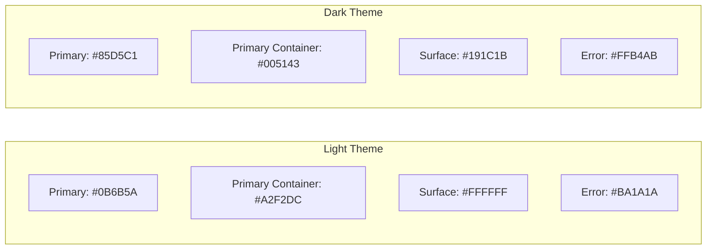

# BharatConnect: UI Design System Specification

This document details the Material 3 design guidelines, screen hierarchies, and component layouts for **BharatConnect**—built to ensure an Android-first, WhatsApp-quality responsive user experience.

---

## 1. Material 3 Color Tokens & Typography

BharatConnect implements the Material 3 color system. The styling properties automatically scale to WCAG AA contrast standards.

### Color Tokens



| Token Name | Light Theme Value | Dark Theme Value | Purpose |
| :--- | :--- | :--- | :--- |
| `--md-primary` | `#0b6b5a` (Teal) | `#85d5c1` (Light Teal) | Main branding, primary action button backgrounds, active nav items. |
| `--md-primary-container`| `#a2f2dc` | `#005143` | Sent chat bubble background, focused inputs. |
| `--md-secondary` | `#4a635d` | `#b0ccc4` | Secondary text buttons, inactive labels. |
| `--md-bg` | `#f8faf9` | `#0f1211` | Application background. |
| `--md-surface` | `#ffffff` | `#191c1b` | Cards, popups, headers, received chat bubbles. |
| `--md-error` | `#ba1a1a` | `#ffb4ab` | SOS/Emergency states, offline banners. |

### Typography

The interface uses **Outfit** (imported via Google Fonts) as the primary font family to give a modern, premium look:
*   **Display Title:** `28px` (Bold, `font-weight: 700`) - Used on Splash and high-level headers.
*   **Headline/Section:** `20px` (Medium, `font-weight: 600`) - Used for page titles.
*   **Subhead:** `15px` (Medium, `font-weight: 500`) - Used for user profile names and list items.
*   **Body Text:** `14px` (Regular, `font-weight: 400`) - Message bubbles and description lists.
*   **Caption/Time:** `11px` (Regular, `font-weight: 400`) - Message status timestamps.

---

## 2. Screen & Navigation Hierarchy

The application navigation architecture divides into two main states: **Authentication Flow** and **Main Shell Routing**.

```
[Root Routing]
 ├── Authentication Flow
 │    ├── 1. Splash Screen (Logo, welcome banner)
 │    ├── 2. Onboarding Carousel (Value propositions)
 │    ├── 3. Phone Registration (OTP request form)
 │    ├── 4. OTP Verification (6-digit code validation)
 │    └── 5. Google Login (Alternative identity binding)
 └── Main App Shell (Bottom Navigation Bar enabled)
      ├── Chats Module
      │    ├── 6. Chat List / Inbox (Conversations thread tracker)
      │    ├── 7. Direct Chat Window (E2EE encrypted chat bubble feed)
      │    └── 8. Group Chat Window (Multi-participant thread)
      ├── 9. Nearby Right Now Module (Geopresence node search list)
      ├── 10. Verified Help Module (Emergency SOS boards)
      ├── 11. Need It Now Module (Hyper-local gig bidding board)
      └── Settings & Profile Module
           ├── 12. User Profile (Helper rating, validation metadata)
           ├── 13. Settings (Dark theme checkbox, cache clear)
           ├── 14. Notifications Panel (System alerts, bid alerts)
           └── 15. Admin Console (Helper document reviews)
```

---

## 3. Core Component Specifications

### 1. Navigation Bars
*   **Status Bar (Height: 36dp):** Top-most indicator displaying system time, active connection tags (`📶 LTE` or `✈️ OFFLINE`), and battery level.
*   **Bottom Navigation Bar (Height: 64dp):** Houses 5 tab buttons: *Chats*, *Nearby*, *SOS*, *Gigs*, and *Profile*.
    *   *Active state:* Draws a container pill using `--md-primary-container` around the icon.
    *   *Inactive state:* Desaturated gray `--md-on-surface-variant`.

### 2. Chat Bubbles (WhatsApp Quality)
*   **Sent Message:** Aligned right, rounded corners (`16dp` radius, except bottom-right which is `2dp`). Uses `--md-primary-container` background with double checkmarks (`✓✓`) representing delivery state.
*   **Received Message:** Aligned left, rounded corners (`16dp` radius, except bottom-left which is `2dp`). Uses `--md-surface` background with a subtle box-shadow for contrast.

### 3. SOS emergency Cards (Verified Help)
*   **Layout:** Card styled with a `4dp` left border indicator.
*   **Border Color:** Red (`--md-error`) for active emergencies, Teal (`--md-primary`) for general alerts.
*   **Details:** Includes time-stamp badge, title, min trust score parameter, and a quick volunteer call-to-action button.

### 4. Interactive Gig Bids (Need It Now)
*   **Layout:** Flat card with outline border (`--md-surface-variant`).
*   **Header:** Title, budget badge, description.
*   **Footer:** Active bid counters, place bid button.

---

## 4. State Management and Offline Indicators

To preserve usability during drops in mobile network coverage, states are visually handled:

```
[Online WebSocket Conn] ───(Drop)───► [Show Offline Warning Banner]
                                                │
                                                ▼
                                    [Append 🕒 Sent Pending Badge]
                                                │
                                                ▼
                                    [Cache in local Dexie database]
```

*   **Offline Banner:** Slides down from the top status bar displaying a high-contrast red bar: `Running in Offline Mesh Mode (Dexie caching active)`.
*   **Pending Indicators:** A clock icon (`🕒`) replaces checkmarks on chat bubbles and gig lists for items queued locally.
*   **Loading States:** Full-page circular progress spinners and skeletons replace UI cards while databases are hydrating.
*   **Error States:** Prominent error warning cards with explicit retry triggers appear if the WebSocket handshake fails.

---

## 5. Accessibility Guidelines

*   **Touch Targets:** All interactive components (tabs, buttons, list rows, toggle fields) have a minimum dimension of `48dp x 48dp` to prevent accidental selection errors on mobile devices.
*   **Screen Reader Tags (TalkBack/VoiceOver):** Elements utilize descriptive `aria-label` properties (e.g., `aria-label="Sent at 14:02, Double checkmarks, Message delivered"`).
*   **Color-Independent Indicators:** Offline states do not rely solely on color change; they use explicitly changed iconography (`🕒` clock icon, `✈️` flight mode indicator) to ensure clarity for color-blind users.
